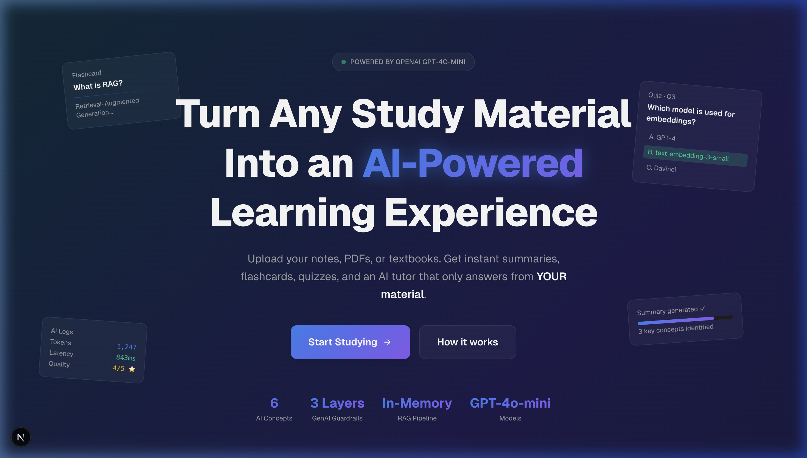
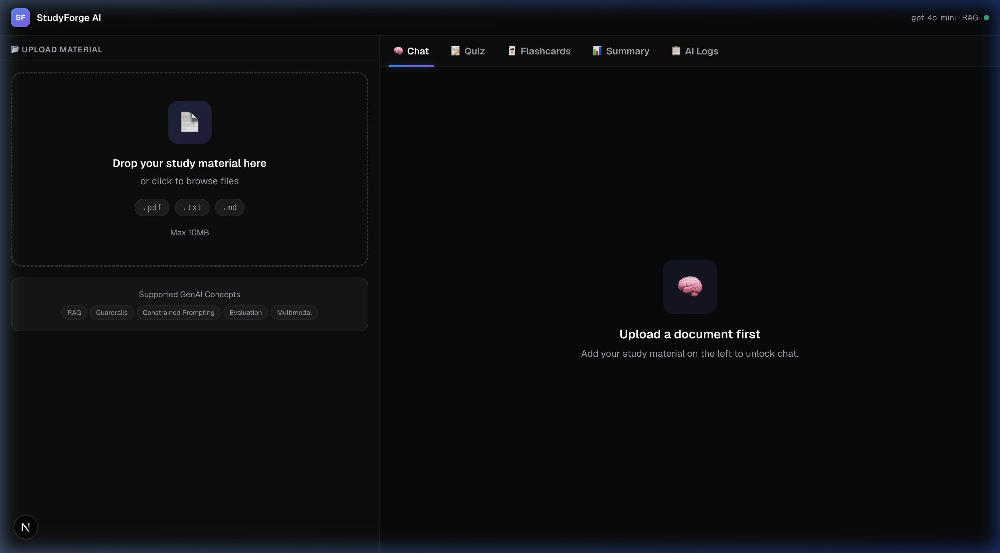
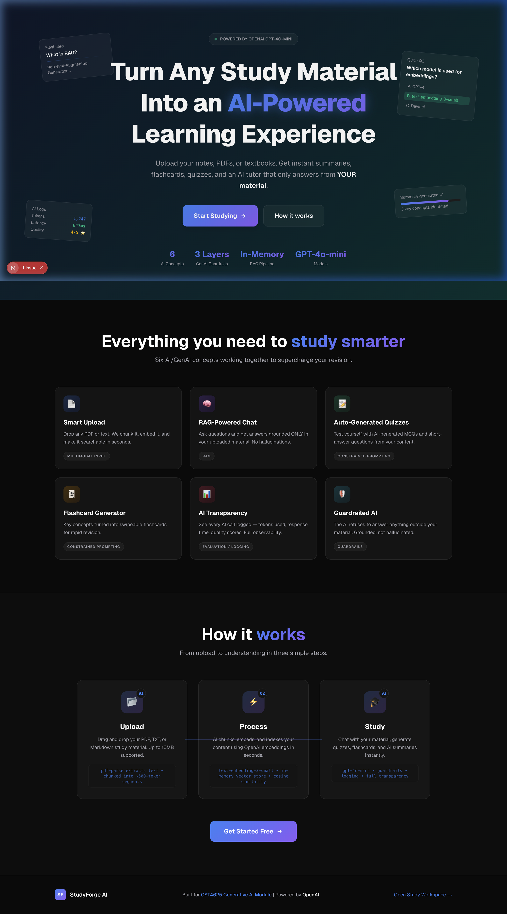

# StudyForge AI 🎓

> **Transform any study material into an AI-powered learning experience — grounded, guardrailed, and built for serious students.**

[](https://nextjs.org)
[](https://www.typescriptlang.org)
[](https://openai.com)
[](https://tailwindcss.com)
[](https://vercel.com)

---

## 📸 Screenshots

### Landing Page — Hero Section


### Study Workspace


### Features & How It Works


---

## 🎯 Problem Statement

Students waste hours manually creating summaries, flashcards, and practice questions from their lecture notes and textbooks — time that should be spent actually learning.

## 💡 Value Proposition

StudyForge AI automates the entire study toolkit in seconds. Upload once → get an AI tutor, instant quiz, flashcard deck, and structured summary — all grounded exclusively in **your own material**, never hallucinated.

## 🤖 AI Approach

Uses OpenAI GPT-4o-mini with a **RAG (Retrieval-Augmented Generation)** pipeline backed by an in-memory vector store. Every AI response is retrieved from, and constrained to, the user's uploaded document. Three layers of guardrails prevent hallucination and prompt injection.

---

## 🚀 Our Journey — How We Built This

This project was built end-to-end as a university hackathon submission for **CST4625 Generative AI Module**. Here's our full journey:

### Phase 1 — Problem Research & Architecture

We identified that existing study tools (Anki, Quizlet) require students to **manually** create flashcards and quizzes — a bottleneck that defeats the purpose of efficient revision. Our hypothesis: if we could automate this pipeline with GenAI while ensuring the AI stays **grounded** in the student's own material (preventing hallucination), it would provide real educational value.

**Key architectural decision:** We chose an in-memory vector store (no external DB) using OpenAI's `text-embedding-3-small` model for embeddings + cosine similarity retrieval. This keeps the stack simple, deployable anywhere, and demonstrates RAG clearly without infrastructure complexity.

### Phase 2 — Constrained Prompting Design

The biggest risk with AI in education is hallucination — the AI making up facts. We designed every system prompt in `lib/prompts.ts` with explicit constraints:

```
1. ONLY answer questions using the provided context...
3. NEVER make up information or use knowledge outside the provided context.
```

This is **Constrained Prompting** — we're not just asking the AI nicely, we're building the constraints structurally into the system prompt template, with the retrieved chunks injected at a specific location.

### Phase 3 — RAG Pipeline Implementation

The RAG pipeline works in three steps:

1. **Chunking** (`lib/chunker.ts`): Documents are split into ~500-token chunks with 50-token overlap at sentence boundaries to preserve context across chunks.
2. **Embedding** (`/api/upload`): Each chunk is embedded using `text-embedding-3-small` via OpenAI Embeddings API and stored in the in-memory vector store.
3. **Retrieval** (`/api/chat`): When a user asks a question, we embed the question and find the top-3 most similar chunks using cosine similarity. These chunks become the grounding context for the answer.

This ensures the AI always reasons from the student's actual material, not from its general training data.

### Phase 4 — Guardrails System

We implemented a 3-layer guardrail system in `lib/guardrails.ts`:

| Layer | Check | Action |
|---|---|---|
| **Input Safety** | Regex patterns for prompt injection (`ignore previous instructions`, `jailbreak`, etc.) | Block before any AI call |
| **Relevance** | Cosine similarity score < 0.3 between question and any chunk | Refuse with explanation |
| **Output Grounding** | Word overlap ratio between response and retrieved chunks | Log warning + quality score |

This demonstrates real-world production thinking — guardrails protect the user AND the AI.

### Phase 5 — Evaluation & Logging

Every single AI call is logged to memory with:
- **Timestamp** — when the call happened
- **Tokens used** — prompt + completion, enabling cost tracking
- **Latency** — end-to-end response time in milliseconds
- **Guardrail status** — did it pass or get blocked?
- **Quality score** — 1-5 stars based on output grounding ratio

The **AI Logs tab** in the workspace visualizes all this in real-time, making GenAI evaluation tangible and demonstrable.

### Phase 6 — Multimodal Input

We support **PDF** (via `pdf-parse` server-side parsing), **plain text (.txt)**, and **Markdown (.md)** files. This demonstrates multimodal input handling — different file formats → unified text extraction → same RAG pipeline.

### Phase 7 — UI/UX Design

We built a premium dark-mode interface with:
- **Animated gradient mesh** background on the landing page (CSS `background-position` animation)
- **Glassmorphism** cards with `backdrop-filter: blur(12px)`
- **3D flashcard flip** using CSS `perspective` and `rotateY` transforms
- **Typing indicator** with staggered dot animation
- **Score reveal** with `scale` keyframe animation
- **Shimmer loading** skeletons for all async operations
- **Responsive split-panel** workspace layout

---

## 🧠 GenAI Concepts Demonstrated

| # | Concept | How It's Implemented |
|---|---|---|
| **1** | 🎯 **Constrained Prompting** | Every system prompt in `lib/prompts.ts` includes explicit numbered rules and strict output format constraints (JSON schema for quiz/flashcards). The AI cannot deviate from the format. |
| **2** | 🔍 **RAG (Retrieval-Augmented Generation)** | Documents chunked into ~500-token segments → embedded with `text-embedding-3-small` → stored in `InMemoryVectorStore` → top-3 chunks retrieved via cosine similarity → injected into the system prompt as grounding context. |
| **3** | 🛡️ **Guardrails** | Three-layer system: (1) Input injection detection via regex, (2) Relevance threshold — similarity score < 0.3 triggers a refuse response, (3) Output grounding check measuring word overlap between AI response and retrieved chunks. |
| **4** | 📊 **Evaluation / Logging** | `lib/logger.ts` captures every AI call: timestamp, model, prompt tokens, completion tokens, total tokens, latency (ms), guardrail pass/fail, similarity score, and a computed quality score (1-5). Viewable in the AI Logs tab. |
| **5** | 📁 **Multimodal Input** | `POST /api/upload` handles PDF files (via `pdf-parse`), `.txt`, and `.md`. Each format goes through the same chunking + embedding pipeline. |
| **6** | ☁️ **Deployment-Ready** | Configured for Vercel with `serverExternalPackages` for `pdf-parse`, proper Next.js App Router API routes, in-memory state (no DB needed), and zero-config Vercel deployment. |

---

## 🛠 Tech Stack

| Category | Technology | Reason |
|---|---|---|
| Framework | **Next.js 16** (App Router) | Full-stack React with API routes, ideal for Vercel |
| Language | **TypeScript** | Type safety across frontend and backend |
| Styling | **Tailwind CSS v4** | Utility-first, fast iteration |
| UI Components | **shadcn/ui** | Accessible, unstyled components we fully customized |
| AI Model | **OpenAI GPT-4o-mini** | Cost-efficient, fast, instruction-following |
| Embeddings | **text-embedding-3-small** | High-quality embeddings at low cost |
| Vector Store | **In-Memory (custom)** | Simple, no infrastructure, cosine similarity from scratch |
| PDF Parsing | **pdf-parse** | Server-side Node.js PDF text extraction |
| Animations | **CSS Keyframes + framer-motion** | No JS animation library overhead for most effects |
| Deployment | **Vercel** | Zero-config Next.js hosting, env var management |

---

## 📁 Project Structure

```
studyforge-ai/
├── src/
│   ├── app/
│   │   ├── layout.tsx                # Root layout — Geist fonts, metadata, Toaster
│   │   ├── page.tsx                  # Landing page (Hero + Features + HowItWorks)
│   │   ├── globals.css               # Full design system: tokens, animations, glassmorphism
│   │   ├── study/
│   │   │   └── page.tsx              # Split-panel study workspace
│   │   └── api/
│   │       ├── upload/route.ts       # POST: parse PDF/txt, chunk, embed, store
│   │       ├── chat/route.ts         # POST: RAG-powered Q&A with guardrails
│   │       ├── generate-quiz/route.ts        # POST: MCQ generation
│   │       ├── generate-flashcards/route.ts  # POST: flashcard generation
│   │       ├── generate-summary/route.ts     # POST: summary generation
│   │       └── logs/route.ts         # GET: AI interaction logs + stats
│   ├── components/
│   │   ├── landing/
│   │   │   ├── Hero.tsx              # Animated gradient hero with floating cards
│   │   │   ├── Features.tsx          # 6-card glassmorphism feature grid
│   │   │   └── HowItWorks.tsx        # 3-step horizontal timeline
│   │   └── study/
│   │       ├── FileUpload.tsx        # Drag-drop zone with progress bar
│   │       ├── DocumentViewer.tsx    # Stats + scrollable text preview
│   │       ├── ChatPanel.tsx         # RAG chat with sources + typing indicator
│   │       ├── QuizPanel.tsx         # Interactive MCQ with scoring + grade
│   │       ├── FlashcardPanel.tsx    # 3D flip cards with know/study-more sorting
│   │       ├── SummaryPanel.tsx      # Markdown summary with copy to clipboard
│   │       └── AILogPanel.tsx        # Real-time AI evaluation table
│   └── lib/
│       ├── types.ts                  # All TypeScript interfaces
│       ├── openai.ts                 # OpenAI client singleton
│       ├── vectorstore.ts            # InMemoryVectorStore with cosine similarity
│       ├── chunker.ts                # Sentence-aware chunking with overlap
│       ├── prompts.ts                # Centralized system prompts
│       ├── guardrails.ts             # 3-layer guardrail + quality scoring
│       └── logger.ts                 # AI interaction logging
├── .env.local                        # Your API key (not committed)
├── .env.example                      # Template for setup
├── next.config.ts                    # serverExternalPackages for pdf-parse
└── README.md                         # This file
```

---

## ⚙️ Setup & Installation

### Prerequisites
- Node.js 18+
- An OpenAI API key ([get one here](https://platform.openai.com/api-keys))

### Local Development

```bash
# 1. Clone the repository
git clone https://github.com/YOUR_USERNAME/studyforge-ai.git
cd studyforge-ai

# 2. Install dependencies
npm install

# 3. Configure environment
cp .env.example .env.local
# Open .env.local and set your OPENAI_API_KEY

# 4. Run the development server
npm run dev

# 5. Open http://localhost:3000
```

---

## 🌐 Deployment (Vercel)

### One-click Deploy
[](https://vercel.com/new/clone?repository-url=https://github.com/YOUR_USERNAME/studyforge-ai)

### Manual Deploy
```bash
# 1. Install Vercel CLI
npm i -g vercel

# 2. Deploy
vercel

# 3. Set environment variable in Vercel dashboard
# Settings → Environment Variables → Add OPENAI_API_KEY
```

**Important:** Add `OPENAI_API_KEY` in your Vercel project's Environment Variables before deploying.

---

## 💬 How to Use

1. **Upload** — Drop a PDF, TXT, or MD file onto the upload zone (left panel)
2. **Chat** — Ask questions about your material in the Chat tab; the AI only answers from what you uploaded
3. **Quiz** — Click "Generate Quiz", select 5/10/15 questions, test yourself with instant feedback
4. **Flashcards** — Generate 10/20/30 flashcards; click to flip; mark "Know It" or "Study More"
5. **Summary** — Generate a Brief / Standard / Detailed summary; copy to clipboard
6. **AI Logs** — See every AI call's token usage, latency, guardrail status, and quality score

---

## 🔒 Guardrails in Action

The AI will **refuse** to answer if:
- The question's similarity score to any document chunk is below 0.3 (not related to your material)
- The input contains prompt injection patterns (`ignore previous instructions`, `jailbreak`, etc.)

The AI response is **quality-scored** if:
- Word overlap between response and retrieved chunks is low → score of 1-2 stars → logged for review

---

## 📊 Sample AI Log Entry

```json
{
  "id": "uuid-...",
  "timestamp": "2024-01-15T14:23:11.000Z",
  "action": "chat",
  "model": "gpt-4o-mini",
  "promptTokens": 847,
  "completionTokens": 312,
  "totalTokens": 1159,
  "latencyMs": 1243,
  "guardrailsPassed": true,
  "similarityScore": 0.724,
  "qualityScore": 4
}
```

---

## 🤝 Team & Credits

Built with ❤️ for **CST4625 Generative AI Module** Hackathon.

- **Framework:** [Next.js](https://nextjs.org) by Vercel
- **AI:** [OpenAI](https://openai.com) GPT-4o-mini + text-embedding-3-small
- **UI:** [shadcn/ui](https://ui.shadcn.com) + custom design system
- **Hosting:** [Vercel](https://vercel.com)

---

<!-- source_handbook: week11-hackathon-preparation -->

*Built for CST4625 Generative AI Module | Powered by OpenAI GPT-4o-mini*
